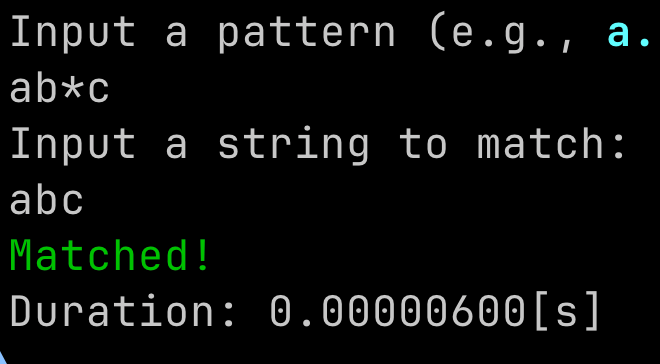
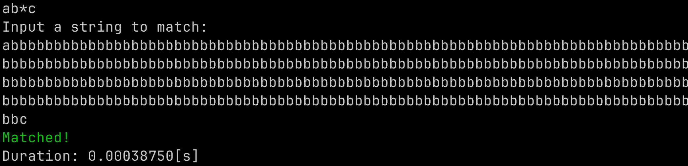
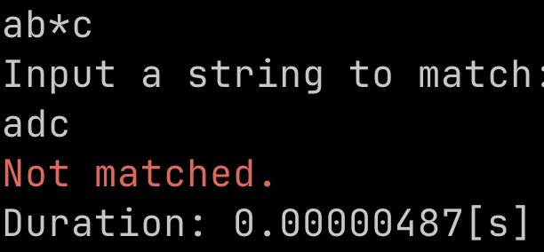

# 正規表現を微分しよう！

きょむ (@kyomu)

---

# 自己紹介

きょむ (@kyomu)
<div class="columns">

<div class="animated-list">

- 情報工学系B3
- 統計とか機械学習とか
- DBスペを受けるらしい


</div>


</div>

---


# 今回のテーマ

# <!--fit--> 正規表現を微分する
---


---


# 正規表現ってなんだっけ？

---

> 正規表現とは、文字列内で文字の組み合わせを照合するために用いられるパターンです。 

<span class="small">
出典

https://developer.mozilla.org/ja/docs/Web/JavaScript/Guide/Regular_expressions

</span>

---

# 正規表現の例

$ab^*c$： $a$に続く0個以上の$b$、その後に$c$が続く文字列 　(例: $ac$, $abc$, $abbc$ ...)

$ab|cd$： $ab$または$cd$のいずれかにマッチする文字列

みたいな感じでパターンマッチングを行える。

どのようにパターンマッチを実装する？

---

# 先頭から文字を削っていくアプローチ

入力文字列$apple$が集合$\{apple, append, apply\}$に含まれているか調べたい

入力文字列の先頭の文字から一文字ずつ、集合内の文字列を削っていく

---
# やってみる

$\underset{\uparrow}{a}pple : \{apple, append, apply\} →  \{pple, ppend, pply\}$

$a\underset{\uparrow}{p}ple : \{pple, ppend, pply\} →  \{ple, pend, ply\}$

$ap\underset{\uparrow}{p}le : \{ple, pend, ply\} →  \{le, end, ly\}$

$app\underset{\uparrow}{l}e : \{le, end, ly\} →  \{e, end, y\}$

$appl\underset{\uparrow}{e} : \{e, end, y\} →  \{ε, nd, y\}$  ←文字を削っていったら$ε$(空文字列)が出てきた!

---


# 文字列を削っていって **$ε$** になったら勝ち✌️
# みたいな考えが使えそう

---

# 正規表現の微分を定義する

> 正規表現$r$を文字$a$で微分したものを$D_a(r)$と表す

---

# 一文字のケース

$a$を$a$で削ったものは**空文字列**になってほしい
$$D_a(a) = ε$$

他の文字を削ろうとした場合は**負け**みたいになってほしい
$$D_a(c) = ∅$$

空文字列とかについても定義しておく
$$ D_a(ε) = ∅ , D_a(∅) = ∅ $$

---

#  連接 $r_1 r_2$

$D_a(r_1 r_2) = D_a(r_1)r_2$としたい所だが... 

$r_1$が$ε$とマッチする場合は$r_2$を$a$で削ったものが残るはず

$$D_a(r_1 r_2) = \begin{cases}
D_a(r_1)r_2 | D_a(r_2) & \text{if } r_1 \text{ matches } ε \\
D_a(r_1) r_2 & \text{otherwise}
\end{cases}$$

---

# 和 $r_1 | r_2$

$D_a(r_1 | r_2)$は$r_1$と$r_2$のそれぞれを$a$で削ったものの和になる

$$D_a(r_1 | r_2) = D_a(r_1) | D_a(r_2)$$


---

# クリーネ閉包 $r^*$

$L(r^*) = \{ε, r, rr, rrr, ... \}$であるから

$$D_a(r^*) = D_a(ε) | D_a(r) | D_a(rr) | D_a(rrr) | ...
$$

に先ほどの連接の微分を適用したりして
$$D_a(r^*) = D_a(r)r^*$$

---

# 微分のまとめ

$$
D_a(a) = ε \\
D_a(c) = ∅ \\
D_a(ε) = ∅ \\
D_a(∅) = ∅ \\
D_a(r_1 r_2) = \begin{cases}
D_a(r_1)r_2 | D_a(r_2) & \text{if } r_1 \text{ matches } ε \\
D_a(r_1) r_2 & \text{otherwise}
\end{cases} \\
D_a(r_1 | r_2) = D_a(r_1) | D_a(r_2) \\
D_a(r^*) = D_a(r)r^*
$$

---

# Rustで実装してみる


---
型の定義

```rust
pub enum MyRegex {
    Char(char),                               
    Eps,                                      // ε
    Empty,                                    // ∅
    Concat(Box<MyRegex>, Box<MyRegex>),       // ⋅
    Or(Box<MyRegex>, Box<MyRegex>),           // |
    Star(Box<MyRegex>),                       // *
}
```

---
入力文字列で正規表現を微分する
```rust
impl MyRegex {
    pub fn whole_match(&self, input: &str) -> bool {
        let mut reg = self.clone();
        for ch in input.chars() {
            reg = reg.derivative(ch);
        }
        reg.match_eps()
    }
}
```
---

微分の実装のイメージ
```rust
pub fn derivative(&self, ch: char) -> MyRegex {
        use MyRegex::*;
        match self {
            Char(c) => if *c == ch { Eps } else { Empty }
            Eps => Empty,
            Empty => Empty,
            Concat(left, right) => {
                let left = Concat(Box::new(left.derivative(ch)), right.clone());
                if left.match_eps() {
                    let right = right.derivative(ch);
                    Or(Box::new(left), Box::new(right))
                } else {
                    left
                }
            }
            Or(left, right) => Or(Box::new(left.derivative(ch)), Box::new(right.derivative(ch)))
            Star(left) => Concat(Box::new(left.derivative(ch), Box::new(Star(left.clone())))
        }
    }
```

微分の実装に加えて、簡易的な構文解析器なども書いて直感的な入力ができるようにした。

---

# 実際に動かしてみる

---


---



**めちゃくちゃ遅い** 

dfaベースの手法とは違って線形時間ではないから仕方なき


---



---

# まとめ

- 正規表現を削っていって空文字列にできるかを調べるというアプローチがある
- けどめちゃくちゃ計算量が悪いので実用的ではない:blob_sad:

実装のレポジトリ：https://github.com/ultsaza/kyomu-regex

---

